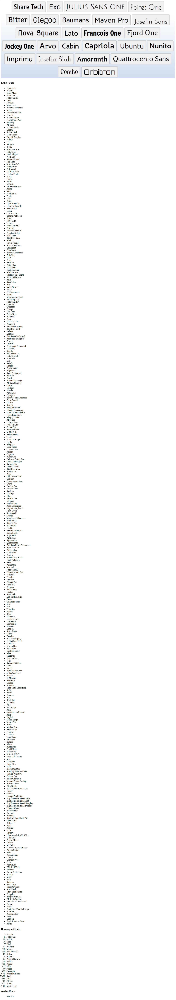

# Pentogram-Font-Catalog-Challenge

## Context

Pentogram is the world’s largest independently owned design studio. It is owned and run equally by 25 partners—all of whom are leaders in the design industry. The design studio is headquartered in London and has offices spread across Austin, Berlin, New York, and San Francisco. Graphic designers spread across different locations are usually posed with the challenge of finding fonts created by their peers. Help the team at Pentogram build a catalog of fonts such that the fonts can be easily located and viewed by the graphic designers.

## Challenge

- The list of fonts can be found in the file `list-of-fonts.txt` in the `./assets` folder.
- Fonts ranging from line number 1 to 341 can be classified as Latin script fonts.
- Fonts ranging from line number 343 to 364 can be classified as Devanagari script fonts.
- Font in the line 366 can be classified as Arabic script font.

Create an index of fonts grouped by script as shared in the image below.

